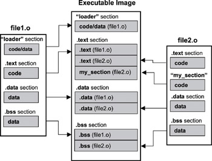

# C언어로 커널 작성

지금까지의 소스 파일은 단일 파일로 구성되었으며, 각 파일은 NASM 컴파일러를 통해 바이너리 형태로 생성되었다. 보호 모드 커널 역시 엔트리 포인트 소스 파일(EntryPoint.s) 하나로 구성되어 있으며, 512바이트로 정렬되어 OS 이미지 파일에 결합되는 구조를 하고 있다.

이번 장에서는 C 소스파일을 추가하고 빌드하여 보호모드 커널 이미지에 통합한다.

C 코드는 어셈블리 코드와 달리 컴파일과 링크 과정을 거쳐서 최종 결과물이 생성된다. 컴파일 과정은 소스 파일을 해석하여 중간 단계인 Object File로 변환하는 과정으로 소스 파일을 해석하여 코드 영역과 데이터 영역으로 나누고, 이러한 메모리 영역에 대한 정소를 생성한다. 링크 단계에는 오브젝트 파일들의 정보를 취합하여 실행 파일에 통합하며 필요한 라이브러리 등을 연결 해주는 역할을 한다.

C 코드를 무작정 빌드해서 합치기만 하면 보호 모드 엔트리 포인트가 뒷부분의 커널을 실행할 수 없으며 빌드 조건과 제약사항이 존재한다.

### 빌드 조건과 제약 사항

1. **C 라이브러리를 사용하지 않게 빌드해야 함**

   부팅된 후 보호모드 커널이 실행되면 C 라이브러리가 없으므로 라이브러리에 포함된 함수를 호출할 수 없다. 다른 애플리케이션 코드처럼 printf 등의 함수를 사용하려면, C 라이브러리를 동적 링크 또는 정적 링크를 해야하는데 커널은 자신을 실행하기 위한 최소한의 환경만 설정하므로 라이브러리의 함수가 정상적으로 실행되지 않는다. 따라서 작성된 커널 코드만 사용하도록 빌드해야한다.

   * **소스 파일 컴파일 - 라이브러리를 사용하지 않는 오브젝트 파일 생성 방법**

     GCC 옵션으로 -c (컴파일 단계까지만 처리), -ffreestanding (라이브러리를 사용하지 않음) 옵션사용

2. **0x10200 위치에서 실행하게끔 빌드해야 함**

   0x10000의 위치에는 이전에 작성한 보호 모드 엔트리 포인트가 존재함으로 결합된 C 코드는 512바이트(1섹터) 이후인 0x10200의 위치부터 로딩된다. 따라서 C로 작성한 커널 부분은 빌드할 때 0x10200 위치에서 실행되는 것을 전제로 해야 하며, 해당 위치의 코드는 C 코드 중 가장 먼저 실행되어야 하는 함수가 위치해야 한다.

   * C언어에서 **전역 변수의 어드레스나 함수의 어드레스를 참조하는 경우 실제로 존재하는 선형 주소로 변환된다. 따라서 메모리에 로딩되는 어드레스가 변한다면, 이러한 값들 역시 변경해줘야 정상적으로 동작할 수 있다.** 이러한 이유 때문에 커널이 0x10200에서 실행되게 빌드하는 것이 필요하다.

   * **오브젝트 파일 링크 - 특정 어드레스에서 실행 가능한 커널 이미지 파일 생성 방법(라이브러리 미사용)**

     오브젝트 파일을 링크하여 실행 파일을 만들기 위해서는 실행 파일을 구성하는 섹션의 배치와 로딩될 어드레스, 코드 내에서 가장 먼저 실행될 코드인 엔트리 포인트를 지정해줘야 한다. 섹션을 배치하는 작업은 오브젝트 파일이나 실행 파일 구조와 관련이 있으므로 다른 작업보다 좀 더 까다롭다. 또한 섹션을 배치하는 방식과 크기 정렬 방식에 따라서 OS의 메모리 구조와 크기가 달라진다.

     #### 섹션 배치와 링커 스크립트, 라이브러리를 사용하지 않는 링크

     섹션(Section)은 실행 파일 또는 오브젝트 파일에 있으며 공통된 속성(코드, 데이터, 각종 심볼과 디버깅 정보 등)을 담는 영역을 뜻한다. 

      

     > 이미지 출처: Quing Li "real time concepts for embedded systems

     링커의 주된 역할은 오브젝트 파일들을 모아 섹션을 통합하고 그에 따라 어드레스를 주정하며, 외부 라이브러리에 있는 함수를 연결해준다. 다만 링커가 실행 파일을 만들기 위해서는 파일 구성에 대한 정보가 필요하며 이때 사용하는 것이 **링커 스크립트(Linker Script)**이다.

     링커 스크립트에는 각 섹션의 배치 순서와 시작 어드레스, 섹션 크기 정렬 등의 정보를 저장해 놓은 파일로 입력 파일의 섹션이 어떻게 출력 파일로 대응하는지, 출력파일의 메모리 상태를 어떻게 조정하는지 지정 한다. 링커는 항상 링커 스크립트를 사용하며 직접 제공하지 않으면 링커는 링커 실행파일에 컴파일된 기본 스크립트를 사용한다.

     우리는 기존에 있던 elf_i386.x 링커 스크립트에서 섹션 배치와 섹션 정렬부분만 수정할 것이다. 

     ###### 링크 스크립트의 기본 형식(구조)

     ```
     SECTIONS
     {
         SectionName	Load Address :	; 섹션 이름과 메모리에 로드할 어드레스
         {
             *(.text)				; 오브젝트 파일의 섹션 중에 SectionName에 통합할 섹션 이름
             ; - 생략 -
             . = ALIGN (AlignValue)	; 현재 어드레스를 Align Value에 맞추어 이동
         } = 0x00000000				; 섹션을 채울 기본 값
         ; - 생략 -
     }
     ```

     섹션 재배치는 텍스트나 데이터와 관계 없는 섹션(.tdata, .tbss, .ctors, .got 등)의 기본 구조를 코드 및 데이터 섹션부분으로 이동하거나, 코드 및 데이터에 관련된 섹션(.text, .data, .bss, .rodata)을 가장 앞으로 이동함으로써 처리할 수 있다.

     수정한 링커 스크립트를 이용해서 라이브러리를 사용하지 않고 실행 파일을 생성하는 방법은 다음과 같다.

     ```
     C:\> x86_64-pc-linux-ld.exe -melf_i386 -T elf_i386.x -nostdlib Main.o -o Main.elf
     ```

     #### 로딩할 메모리 어드레스와 엔트리 포인트 지정

     어셈블리어로 작성된 부트 로더나 보호모드 엔트리 포인트처럼 C 코드 역시 로딩될 메모리를 예측하고 그에 맞춰 이미지를 생성해야 한다. 

     메모리에 로딩하는 어드레스를 지정하는 방법은 링커 스크립트를 수정하는 방법과 링커(LD) 프로그램의 명령줄(Command Line) 옵션으로 지정하는 방식이 있다.

     1.  링커 스크립트를 수정하여 지정하는 방법

        ```
        .text 0x10200
        {
        
        	;- 생략 -
        
        }
        ```

     2. 커맨드 라인 옵션을 통해 지정하는 방법

        ```
        C:\> x86_64-pc-linux-ld.exe -Ttext 0x10200 Main.o -o Main.elf
        ```

     3. 링커 스크립트를 수정하여 특정 함수를 엔트리 포인트로 지정

        ```
        OUTPUT_ARCH(i386)
        ENTRY(MAIN)			; - Main 함수를 엔트리 포인트로 지정
        SEARCH_DIR("/usr/cross/x86_64-pc-linux/lib")
        ```

     4. 커맨드 라인 옵션을 통해 특정 함수를 엔트리 포인트로 지정

        ```
        C:\> x86_64-pc-linux-ld.exe -e Main Main.o -o Main.elf
        ```

     **하지만 엔트리 포인터를 링커에 지정하는 작업은 빌드의 결과물이 OS에 의해 실행 가능한 파일 포맷(ELF, PE 등)일 때만 의미가 있다**. (바이너리 형태로 변환하면 엔트리 포인트 정보가 제거됨)   머여 ㅡㅡ;

     따라서 다른 방법을 이용해야 하는데 이때 사용하는 것이 특정 함수의 순서(위치)를 조작하는 방법이다.

     첫번째는 **오브젝트 파일 내의 함수 간의 순서**로 오브젝트 파일은 소스 파일로부터 생성되고, 컴파일러는 특별한 옵션이 없는 한 소스파일에 정의된 함수의 순서대로 오브젝트 파일의 내용을 생성한다. 따라서 C 소스 파일에서 엔트리 포인트 함수를 가장 상위로 옮겨 주어야 한다.

     두번째는 **실행 파일 내의 함수 간의 순서**로 컴파일러와 마찬가지로 실행 파일은 오브젝트 파일로부터 생성되고, 링커는 특별한 옵션이 없는 한 입력으로 주어진 오브젝트 파일의 순서대로 통합하여 실행 파일을 생성한다. 따라서 엔트리 포인트가 포함된 오브젝트 파일을 가장 앞쪽으로 옮겨주여야 한다.

     > 링커 스크립트 메뉴얼 번역: http://korea.gnu.org/manual/release/ld/ld-mahajjh/
     >
     > 메뉴얼 영문판 https://sourceware.org/binutils/docs/ld/

3. **코드나 데이터 외의 기타 정보를 포함하지 않은 순수한 바이너리 파일 형태여야함**

   일반적으로 GCC 등의 컴파일러를 통해 실행 파일을 생성하면 ELF, PE 파일 포맷과 같이 특정 OS에서 실행할 수 있는 포맷으로 생성되는데 이러한 파일 포맷들은 필요한 코드와 데이터 정보 이외의 불필요한 정보들을 포함하고 있고 이를 그대로 사용하면 엔트리 포인트에서 파일 포맷을 해석하여 처리하는 기능이 포함되야 한다.

   코드와 데이터만 포함된 바이너리 파일의 형태를 사용한다면, 엔트리 포인트에서 해당 어드레스로 점프 하는것만으로도 C 코드를 실행할 수 있다.

   #### 실행 파일을 바이너리 파일로 변환

   실행 파일에서 순수한 바이너리 파일 형태로 변환하기 위해서는 꼭 필요한 코드 섹션과 데이터 섹션만 추출하고 불필요한 섹션들을 제외해야 한다. 이때 objdump를 사용하면 작업을 손쉽게 처리할 수 있다.

   ```
   C:\> x86_64-pc-linux-objdump -j .text -j .rodata -j .bss -S -O binary Kernel32.elf Kernel32.bin
   -j: 실행 파일에서 해당 섹션만 추출
   -S: 실행 파일에서 재배치 정보와 심볼을 제거
   -O: 새로 생성할 파일의 포맷을 지정
   ```


